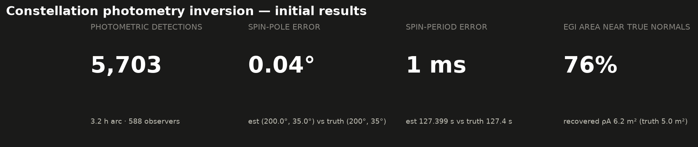
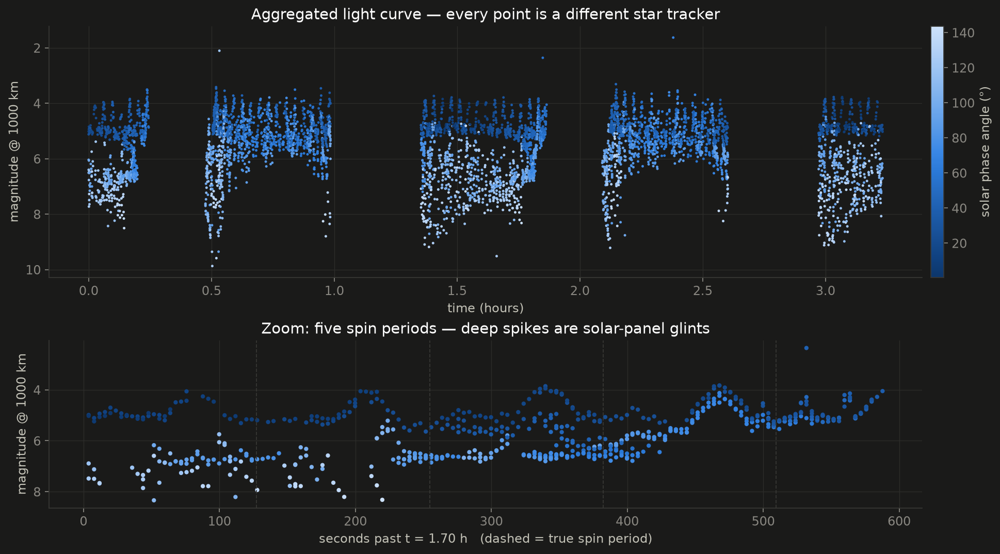

# photometry

Estimating RSO attitude and shape from visual-magnitude measurements aggregated
across a large LEO constellation's star trackers. See
[docs/constellation-photometric-attitude-shape-estimation.md](docs/constellation-photometric-attitude-shape-estimation.md)
for the full design.

## What's here

- `src/photometry/` — simulation of opportunistic star-tracker detections
  (Walker shell, LVLH-mounted trackers, facet-BRDF radiometry) and inversion
  (spin-period periodogram, spin-pole grid search, EGI shape recovery by NNLS).
- `src/photometry/measurements.py` — the `ObservationSet` schema. This is the
  real-data interface: reduce calibrated tracklets (time, angles, magnitude,
  range from OD) into this schema and run the identical inversion code.
- `scripts/run_pipeline.py` — end-to-end: simulate → invert → `results/`.
- `scripts/make_charts.py` — dark-themed chart set from saved results.
- `results/` — baseline scenario outputs and charts.

## Quickstart

```bash
pip install -e .
python scripts/run_pipeline.py results
python scripts/make_charts.py results results/charts
python -m pytest tests/
```

## Baseline scenario results

10,000-satellite Walker shell (550 km / 53°), trackers 5° above local
horizontal; tumbling box-wing target at 620 km spinning at 127.4 s. Over a
3.2 h arc: **5,703 detections from 588 distinct observers**, phase angles
14–142°. Recovery: spin period to **1 ms**, spin pole to **0.04°**, and the
convex shape's extended Gaussian image with 76% of recovered albedo-area
within 15° of true facet normals (the anti-sunward facet is unilluminated
for the whole arc and correctly unobservable).



