# photometry

Estimating the attitude and shape of resident space objects (RSOs) from
visual-magnitude measurements aggregated across a large LEO
constellation's star trackers. See
[docs/constellation-photometric-attitude-shape-estimation.md](docs/constellation-photometric-attitude-shape-estimation.md)
for the founding design document; this README is the results write-up. A
dark-themed briefing deck of the same material is at
[docs/photometry_briefing.pptx](docs/photometry_briefing.pptx), and
[docs/real-data-integration.md](docs/real-data-integration.md) is the
guide for wiring the experiment to real data sources.

## The idea in one paragraph

10,000 satellites each carry three star trackers canted ~5° above the
local horizontal to avoid Earth albedo. Any other object above the shell
crosses those fields of view constantly, so the fleet opportunistically
measures thousands of time-tagged brightnesses of the same target per
day — from hundreds of directions at once. A single ground telescope
sees one light curve; the constellation samples the target's reflected
light *field*, which turns the classically ill-posed light-curve
inversion into a well-conditioned tomography problem. From magnitudes
alone we recover spin state, convex shape, catalog identity, solar-array
configuration, and deviations from catalog.

## Quickstart

```bash
pip install -e .
python scripts/run_pipeline.py results          # baseline sim + inversion
python scripts/run_fleet_study.py               # 21-scenario day-in-the-life
python scripts/run_model_match.py               # library identification
python scripts/run_refine.py                    # residual-EGI demo
python scripts/run_deviation_scan.py            # fleet deviation alerts
python scripts/run_torquefree.py                # Tier-3 multi-axis fit
python scripts/run_glints.py                    # glint detector + Wahba waypoints
python scripts/run_library_scale.py             # 209-model catalog-scale ID test
python scripts/make_charts.py; python scripts/make_fleet_charts.py
python scripts/make_glint_chart.py; python scripts/make_scale_charts.py
python scripts/make_movies.py                   # all validation movies
python -m pytest tests/
```

---

## Concepts: what photometry can and cannot know

**The measurement.** Every detection is one number: the apparent visual
magnitude of an unresolved dot, plus the time, the observer's position,
and the line of sight. Range is known from multi-observer orbit
determination, so the 1/d² factor is removed exactly and each detection
becomes a sample of the target's *range-normalized brightness* at one
(sun direction, observer direction) pair.

**The EGI — Extended Gaussian Image.** The shape representation that
photometry actually constrains. Take every patch of the target's
surface, note which direction its outward normal points and how much
reflecting area it has, and pile all of that onto a sphere of
directions: the EGI is the function "reflecting area per unit direction"
on that sphere. Two facts make it central here:

1. *It is all photometry can see.* An unresolved brightness measurement
   is a weighted integral of oriented area — every facet's light lands in
   the same pixel, so **position on the body is unrecoverable**. A solar
   panel mounted left of the bus and the same panel mounted right of the
   bus produce identical light curves. What survives is how much area
   faces each way.
2. *It is enough to get a body back.* Minkowski's theorem: a valid EGI
   corresponds to exactly one convex body (up to translation). So we
   invert brightness → EGI (a convex least-squares problem), then
   reconstruct EGI → convex solid (`inversion/minkowski.py`).

**Contrast with photogrammetry.** A photogram is a resolved image;
photogrammetry triangulates *positions* of surface points across many
images to build a model with spatial structure. Photometry is the
unresolved limit — no pixels on the target, ever — so instead of point
positions we get the direction-space dual: oriented area. The movies
render both the raw EGI (magenta disks, positions deliberately
"exploded" outward because they have none) and the Minkowski solid it
implies (orange), against the truth geometry (blue).

**Attitude enters as rotation of the EGI.** The body-frame EGI is
constant; the attitude history rotates it relative to the sun and
observers. That factorization — static shape × time-varying rotation —
is what every estimator below exploits.

---

## The modeling progression

The project alternated between enriching the *truth* (making the
simulated world harder) and strengthening the *algorithms* until they
caught up. Reading this table top-to-bottom is the development history.

### Truth side — what the simulator generates

| Stage | Model added | Why it matters |
|---|---|---|
| T1 | Walker shell (100×100 sats, 550 km/53°), three trackers per sat at +5° LVLH elevation, 7° half-angle FOV, sun exclusion, Earth-limb clearance, eclipse | The opportunistic sensor. Also produced the first architectural finding: up-canted trackers only see objects **above** the shell |
| T2 | Facet radiometry: Lambert + Phong per facet, material classes (MLI, cells, white paint, antenna) | Brightness is BRDF physics, not albedo-times-area; specular glints carry the sharpest attitude information |
| T3 | Generic box-wing target, principal-axis spin | The controlled baseline every algorithm was first proven on |
| T4 | Seven-satellite library from open-source dimensions: Starlink v1.5 / v2 mini / v2 mini DTC, BlueWalker 3, Hubble, ISS, Katalyst LINK | Real geometry diversity: plates, tubes, giant slabs, bus+wings |
| T5 | Attitude modes: LVLH-hold ops, knife-edge low-drag, sun-point, inertial science pointing, propeller tumble | Day-in-the-life truth; each mode has a distinct photometric signature |
| T6 | Solar-array articulation: per-facet gimbals (fixed / 1-axis / 2-axis) tracking the sun in the forward model | Arrays are not body-fixed — a fact the inversion must and does confront |
| T7 | Sensor saturation as *censoring*: saturated streaks recorded as brighter-than-cap lower bounds | ISS-class targets are ~80% censored; dropping those rows biases everything toward small objects |
| T8 | Torque-free rigid-body tumble (triaxial inertia, nutating ω, energy conserved to 3e-8) | LINK's actual anomaly class: multi-axis spin, no principal-axis shortcut |
| T9 | Procedural 200-entry hypothetical library (`library200.py`): 11 families × 38 countries with per-family attitude/array-mode sets, ranges grounded on Gunter's Space Page & eoPortal archetypes; array *off-pointing* as a control state the matcher has no hypothesis for | The catalog-scale world: identification must survive hundreds of candidates, and truth flies modes outside the hypothesis bank |

### Algorithm side — the inversion stack

| Stage | Algorithm | Problem it solved | Evidence |
|---|---|---|---|
| A1 | Lomb–Scargle periodogram on the aggregated brightness stream (arc-length-sized frequency grid) | Spin period from multi-observer data | Baseline period sub-ms |
| A2 | Spin-pole grid search (Fibonacci sphere × phase × body spin axis) + simplex refinement | Full spin state; flat-spin vs propeller distinction | Baseline pole to **0.1°**; LINK tumble pole 0.07°, correct body axis |
| A3 | EGI by non-negative least squares (Lambert kernel), then joint Lambert+Phong basis with dead-column pruning and scale-aware ridge | Shape from brightness; specular leakage bias +25% → −9% | 99% of recovered area within 15° of true normals |
| A4 | Tier-2 mode classifier: named operational laws + fitted spin/inertial families | "Is it controlled, safe-moded, or tumbling?" | 20/21 scenarios correct (the miss is Hubble's axisymmetric tumble — physically unobservable rotation) |
| A5 | Minkowski reconstruction, fixed-point then **variational** (support-functional L-BFGS-B, analytic gradient dV/dh = face areas) | EGI → actual convex solid; slab proportions fixed | v1.5 slab reconstructs 7.7×3.7×1.0 m vs 8.1×2.7 truth, areas matched exactly |
| A6 | Library identification: model × attitude family × array config, 0.5-mag offset prior so absolute brightness carries size | "Which catalog object is this, in what state?" | **20/21 correct** incl. DTC vs plain v2 mini (cost 1.09 vs 2.64) |
| A7 | Matched-model refinement: symmetry-group multi-start (axis swaps, flips, antipodes) + signed residual EGI | Catalog-deviation detection; ambiguity twins resolved | Seeded missing-antenna case: +0.55 m² at the right normal, rms 1.57→1.02 |
| A8 | Deviation alerting (structure ratio + fit-quality criteria) | Automated "reality vs catalog" flag | **20/21 alert decisions correct** fleet-wide |
| A9 | Censoring-aware costs (one-sided Tobit terms), stratified sampling, coherent period ladder | Saturation-dominated targets | ISS size information restored (truth-attitude cost 0.18 vs impostors 8.8+); global search still open |
| A10 | Tier-3 torque-free fit: window-laddered multi-start over inertia + rate + attitude via solve_ivp quaternion path | Non-principal-axis tumbles | Attitude error **halved** vs uniform spin (97.8°→50.7° window, 97.6°→56.0° 4 h prediction) |
| A11 | Glint tier: phase-conditioned cross-sectional detector → facet correspondence → **Wahba's problem** (Davenport q-method) on (body normal, inertial bisector) pairs | Absolute attitude waypoints from specular events; symmetry-twin disambiguation | Waypoints at 2.9° (LINK tumble); oracle gate resolves the v1.5 twin (5.5° vs 86°) and yields 25 waypoints @ 3.4° through the torque-free arc |
| A12 | Catalog-scale funnel: Malmquist-corrected feature gate + two-channel shortlist (named-hypothesis quick fits ∪ tumble brightness fingerprints) ahead of the full matcher | Identification against hundreds of models at tractable cost | 209 models, 24 sampled targets, 3 h arcs: exact identity 29%, **family/class 71%**, funnel ~2 s + match ~3 min per target; wrong IDs are dominated by same-family photometric twins that fit within 1.2× of truth |

---

## Results

### Baseline: tumbling box-wing, 3.2 h arc

5,703 detections from 588 distinct observers, phase angles 14–142°.
Spin period exact to sub-ms, pole to 0.1°, EGI with 99% of recovered
albedo-area within 15° of true facet normals (the anti-sunward facet is
unilluminated all arc and correctly unobservable).


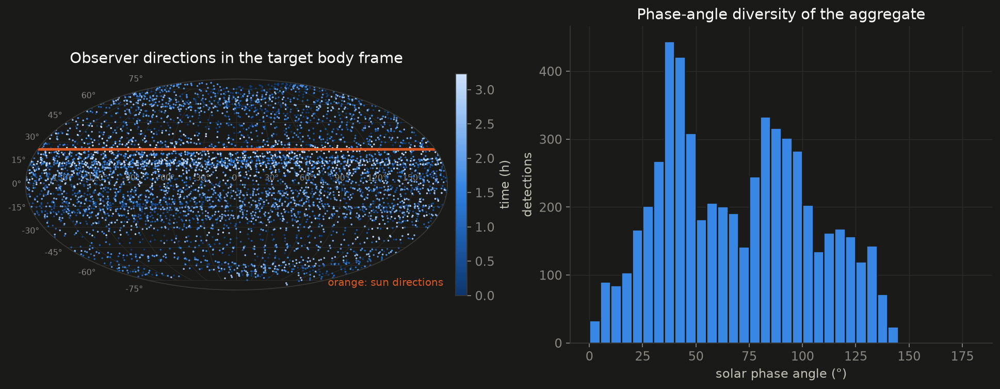
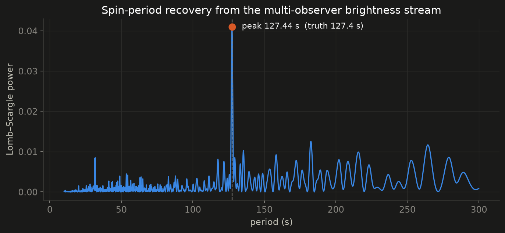
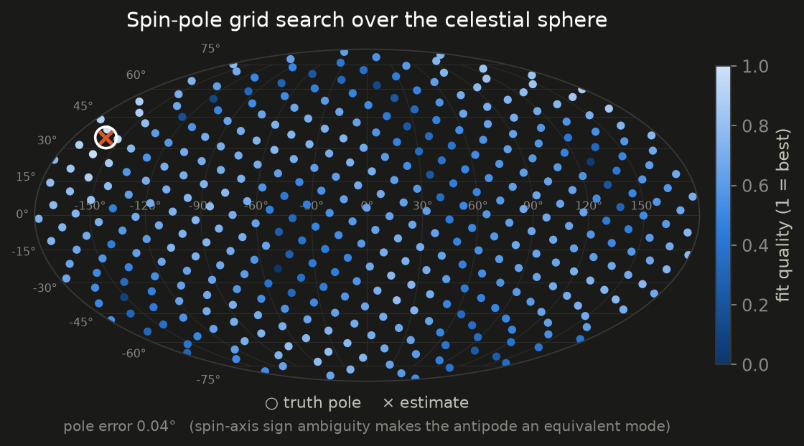
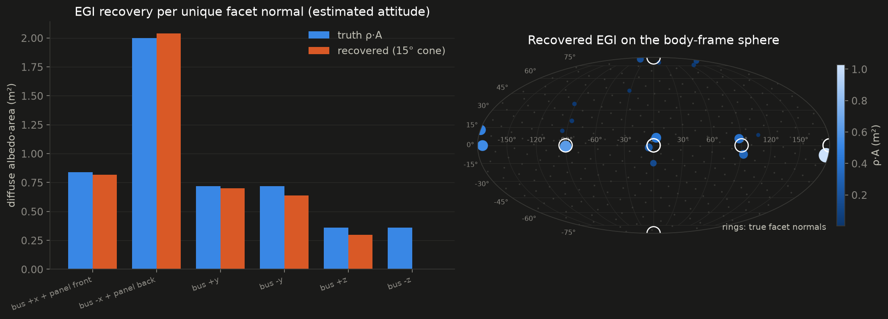

### Day-in-the-life fleet study (21 scenarios × 24 h)


Sun-tracking arrays are not body-fixed, so ops-mode EGIs recover exactly
the bus + fixed antennas; tumble modes recover the full body. ISS is
saturation-limited yet classifies correctly from a few thousand
unsaturated long-range detections per day.

### Library model identification

**How to read the grid:** the attitude-hypothesis bank is
spacecraft-agnostic — LVLH-hold, knife-edge, sun-point, a *fitted*
uniform spin, and a *fitted* fixed-inertial attitude, with both array
configurations wherever the candidate model has gimbals. For every
(scenario, candidate model) cell we fit that entire bank **for that
model** and plot the best cost, normalized per row. So no cell is a null
test: the fitted families always produce a best-effort attitude, which
is why impostor models show finite-but-poor costs rather than N/A —
and semantically odd pairings (a knife-edge ISS) are simply hypotheses
that lose on cost and never win a row. The row label shows the winning
hypothesis and array configuration for the identified model.


The one miss (tumbling ISS → "Hubble") fits nothing well — best cost 29
where genuine matches score ~1, so a fielded system reports "no
confident match"; the deviation alert flags it independently. Root
cause and partial fix are in the censoring section below.

### Matched-model refinement and residual EGI


The signed residual EGI is the "does reality match the catalog"
product: matching the DTC scenario against the plain v2 mini recovers
+0.55 m² of residual area within 25° of the missing antenna's nadir
normal, while correct-model controls stay at the noise floor.

### Catalog-deviation alert scan

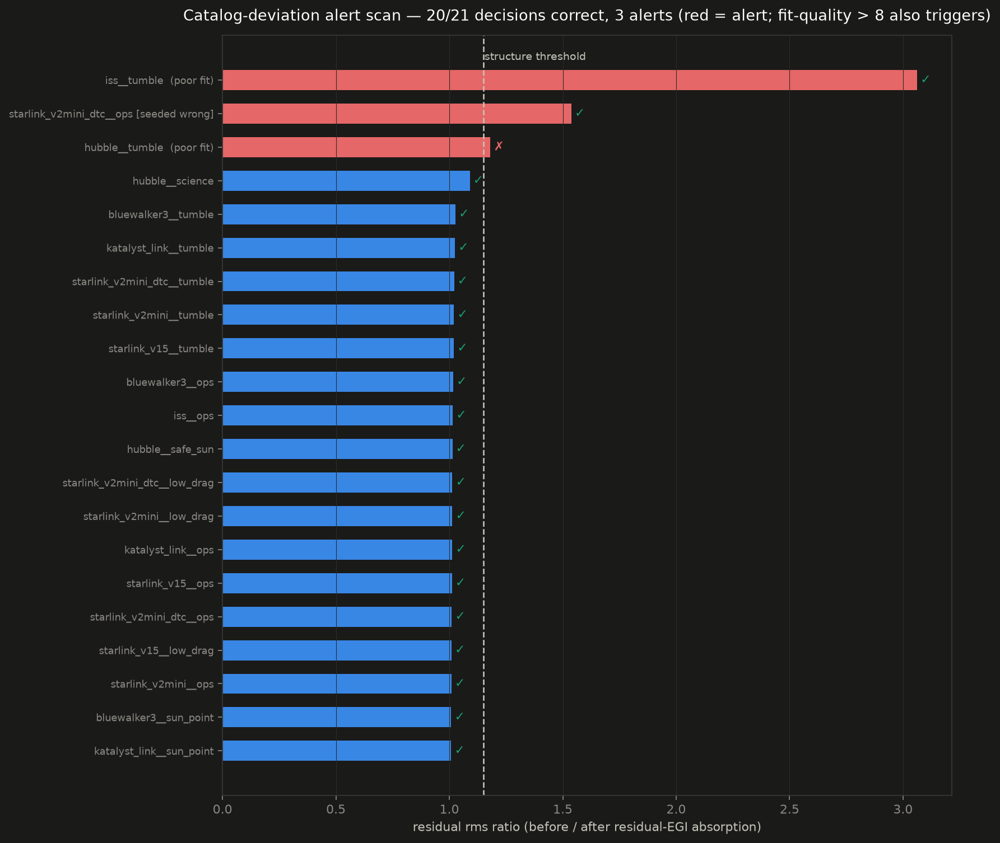

20/21 decisions correct (alert = residual-structure ratio > 1.15 or
refined cost > 8). The remaining flag — Hubble's axisymmetric tumble —
is arguably a true positive: the identified inertial attitude genuinely
cannot explain the frozen arrays sweeping with the real rotation.

### Torque-free (multi-axis) tumble

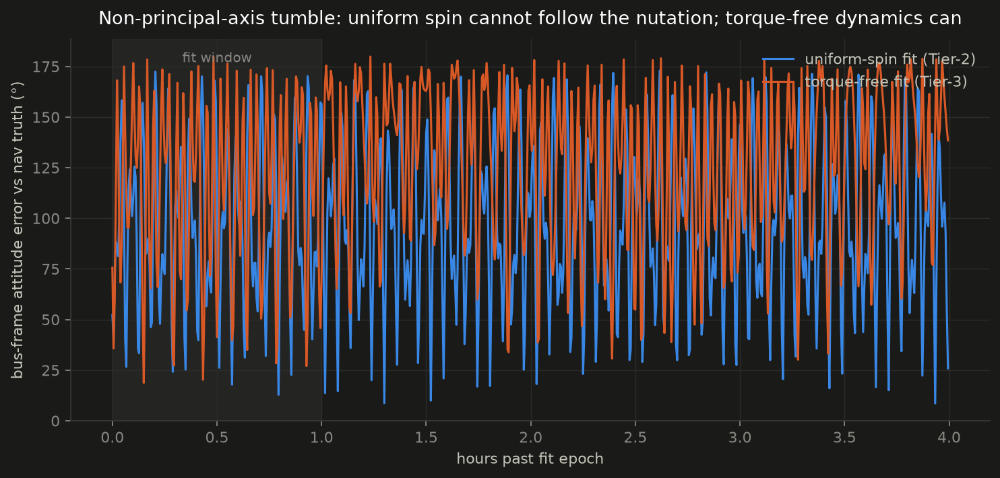

### Glint geometry: Wahba's problem on specular events

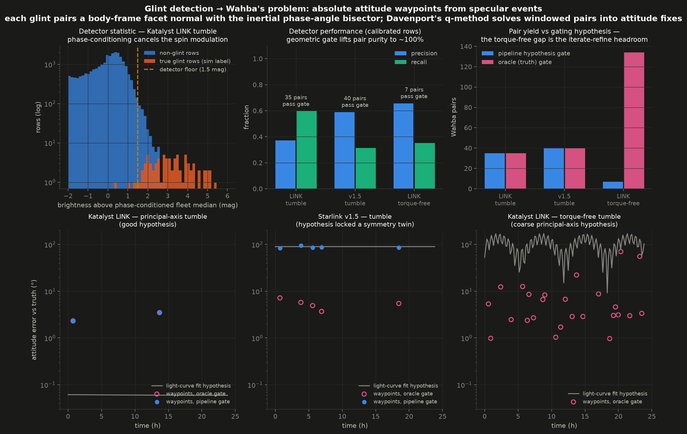

A specular glint is the one moment photometry yields a *direction*: the
phase-angle bisector (known in ECI from that row's geometry) coincides
with a facet normal (known in the body frame from the library model).
The glint tier detects candidates with a phase-conditioned
cross-sectional outlier test — brightness is compared against the fleet
median *at the same rotational phase*, which cancels the diffuse spin
modulation — then gates them geometrically under an attitude hypothesis,
which assigns the facet correspondence. Each confirmed glint is a matched
vector pair, and Davenport's q-method turns a window of pairs into an
absolute attitude waypoint.

Measured on the tumble scenarios: the geometric gate lifts pair purity to
~100% (every gated pair is a true glint), waypoints land at 2.9° median
error for the principal-axis LINK tumble, and two structural results
follow. First, correctly assigned correspondences **resolve the
symmetry twin** that scalar photometry cannot (Starlink v1.5: 5.5° with
oracle gating vs 86° riding the twin). Second, the torque-free arc
carries **25 recoverable waypoints at 3.4° median** — but only 7 pairs
survive gating under the coarse principal-axis hypothesis the pipeline
currently has. That gap is the iterate-refine headroom: waypoints from
good windows refine the hypothesis, which unlocks more windows, and the
waypoint sequence is exactly the seeding the Tier-3 dynamics fit lacks.

### Catalog-scale identification: 209 models

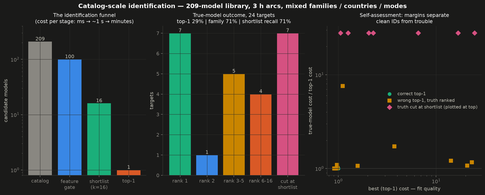

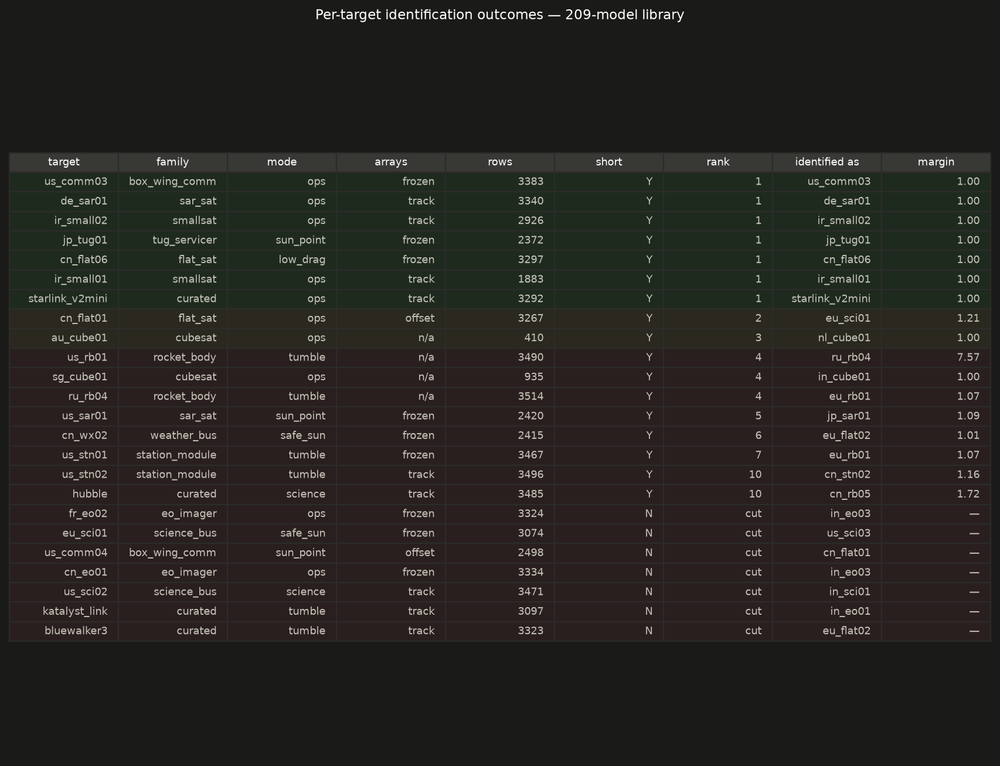

The 200-entry generated library (11 families, 38 countries, per-family
attitude and array-control mode sets, dimension ranges grounded on
Gunter's Space Page / eoPortal archetypes) joins the curated models in
one namespace, and identification runs as an operational funnel:
periodogram → feature gate (milliseconds) → two-channel shortlist
(~2 s: named-hypothesis quick fits for stable targets ∪ attitude-free
brightness-decile fingerprints for tumblers) → full matcher on the
shortlist only (~3 min/target).

**Results, 24 sampled targets on 3 h arcs: top-1 exact identity 29%,
correct family/class 71%, shortlist recall 71%.** The drop from the
curated study's 20/21 is the honest price of scale, and it decomposes
into three structural causes rather than one algorithmic failure:

1. **Look-alike degeneracy — the dominant cause.** 10 of the 17
   non-top-1 outcomes picked a *same-family twin* (a 3U cubesat for a 3U
   cubesat, a cylinder for a cylinder), and for targets where truth
   ranked 2+ the truth-to-winner cost ratio was ≤ 1.21 in 8 of 10
   cases: the truth fits essentially as well as the winner. Once a
   catalog contains photometric twins, the *exact* identity is not in
   the data — class, size, and configuration are. Country of origin is,
   unsurprisingly, not a photometric observable.
2. **Self-assessment still works.** Every correct identification has
   fit cost ≤ 1.0; 13 of 17 wrong ones flag themselves with elevated
   cost (1.05–25) or a shortlist cut. Four look-alike confusions fit at
   cost < 1.0 — confident and wrong — and those are exactly the twin
   cases above, where "one of these near-identical models" is the
   correct achievable claim.
3. **Funnel gaps are enumerable.** The seven shortlist cuts cluster in
   known blind spots: inertially-pointed targets fall between the two
   channels (the named-fit channel has no inertial hypothesis — a
   third channel is the fix), the fingerprint channel weakens on 3 h
   arcs vs the 24 h validation arcs, and one of the two deliberately
   off-pointed-array targets was cut because *no* hypothesis in the
   bank flies its control state (the other survived at rank 2).

Per-target rows: `results/library_scale/summary.json`.

### Validation animations

Each movie shows, in the target's LVLH frame: **left** — truth geometry
(blue) with the model-free inversion products (orange Minkowski solid,
magenta raw-EGI disks); **right** — the identified library model at the
identified attitude and array articulation (green) over faint truth;
**bottom** — projections onto the three LVLH planes. Attitude error vs
nav truth is annotated per frame. All 21 are in
[results/movies/](results/movies/); four representative ones:

*Katalyst LINK, principal-axis tumble — identified at the noise floor,
0.1° attitude error, plate solid riding the array plane:*

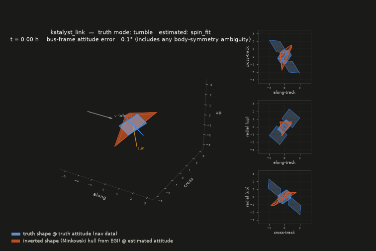

*Starlink v2 mini DTC, nadir ops — arrays articulate toward the sun in
the truth render; identification correct including "arrays tracking":*

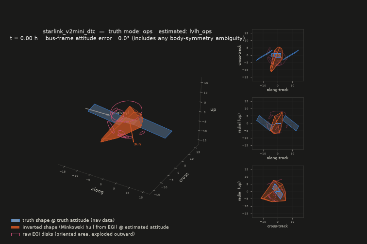

*ISS tumble — the one misidentification, visibly wrong (tiny Hubble tube
inside the real station) and flagged by its outlier cost:*

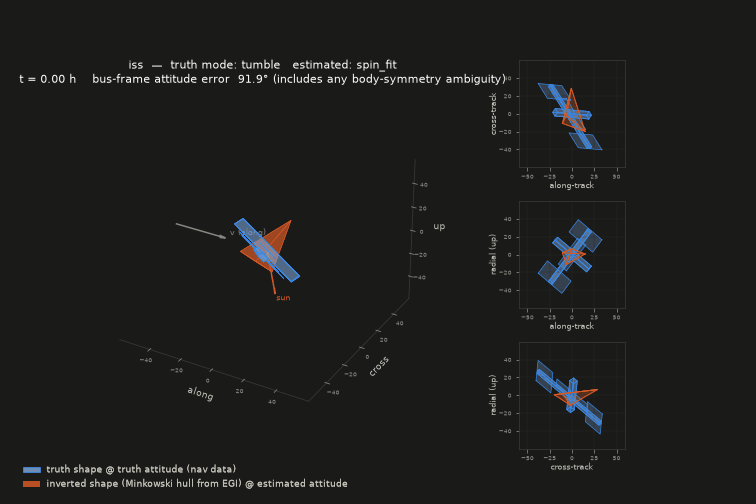

*Katalyst LINK, multi-axis (torque-free) tumble — Tier-3 fit in the
right panel, error halved vs uniform spin:*

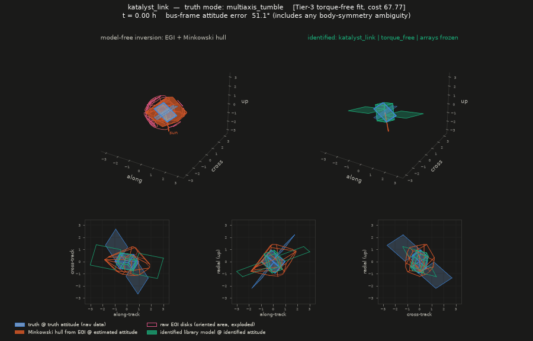

---

## Standing findings

- **Altitude visibility envelope**: +5°-canted trackers only see objects
  above the shell; ISS (420 km), Hubble (~530 km), LINK/Swift (~500 km)
  are invisible to a 550 km shell at their real altitudes. The study
  flies all targets at a common 620 km orbit.
- **Censoring is the tall pole for big objects**: the bright spin phases
  are exactly the saturated ones, so calibrated-only photometry both
  shrinks apparent size and hides the spin. One-sided censored terms
  restore the size information; the spin lives in the *saturation timing
  pattern* and needs the harmonic-aware ladder (open).
- **Discrete ambiguities are structural**: 90° body-axis swaps for
  plates, 180° flips for tubes, pole antipodes. They must be searched
  explicitly (refinement does) and reported as posterior modes.
- **Articulation is information**: "arrays tracking vs frozen" is
  directly identifiable, and an inertially pointed telescope still
  sun-tracks its arrays — omitting that config produced a false alarm
  until modeled.
- **Glints are geometry, not just nuisance**: the same bright specular
  rows the Huber cost clips are, read the other way, matched vector
  pairs for Wahba's problem — and correctly assigned correspondences
  break symmetry twins that scalar photometry structurally cannot.
- **Cheap physics beats clever features at catalog scale**: feature
  heuristics alone could not rank 209 models stably; a ~30 ms
  named-hypothesis fit per model (stable targets) plus attitude-free
  brightness fingerprints (tumblers) makes the funnel reliable at ~1 s
  per target. Coarse *spin-grid* fitting, by contrast, ranks tumblers
  by noise — measured truth ranks of 25–100 — and was removed.
- **At catalog scale the product is class + configuration + state, not
  serial number**: photometric twins within a family fit each other's
  data at cost ratios ≤1.2, so exact-identity top-1 falls to 29% while
  family/class holds at 71% on 3 h arcs. The operational deliverable is
  the ranked shortlist with margins — "one of these three 3U cubesats,
  in ops attitude, arrays tracking" — plus the non-photometric prior
  (orbit catalog correlation) that breaks the tie for free in practice.

## Where to head next

1. **Glint-seeded torque-free fitting**: the Wahba waypoints (A11) are
   absolute attitude fixes through the tumble arc — fit the dynamics
   *through the waypoints* instead of searching 10 parameters against
   scalar brightness (where Nelder-Mead reaches 50° but not the basin
   floor; truth verifies at cost 1.04). Requires closing the
   iterate-refine loop: waypoints from well-gated windows refine the
   hypothesis, unlocking the remaining windows (7 → 134 pairs measured
   headroom). CMA-ES / differentiable dynamics stay the fallback.
2. **Harmonic-aware censored period ladder** to close the last
   misidentification (ISS-class tumblers).
3. **Maneuver-window change-point scanning** (stored follow-up):
   freeze the identified hypothesis, score it in time bins at several
   resolutions, and treat bins where the majority-match fails as
   maneuver/anomaly windows to introspect recursively.
4. **Close the funnel's enumerated gaps** from the catalog-scale test:
   a third shortlist channel for inertially-pointed targets (coarse
   fixed-attitude grid), arc-length-aware fingerprints, off-pointed
   array hypotheses in the matcher, and orbit-catalog correlation as
   the tie-breaking prior among photometric twins.
5. **Per-sensor photometric bias estimation** — the untouched piece of
   the design doc's calibration story (30k sensors, cooperative
   constellation targets as truth).
6. **Non-convex shape cues**: shadowing signatures at high phase angles;
   the EGI bounds only the convex hull.
7. **Real tracklets**: reduce to `ObservationSet`
   (`src/photometry/measurements.py`) and the identical stack runs — that
   schema is the sim/real seam by construction. The full wiring guide —
   sources by role, the reduction pipeline, the calibration loop, code
   adapters, and a worked loader skeleton — is
   [docs/real-data-integration.md](docs/real-data-integration.md).
