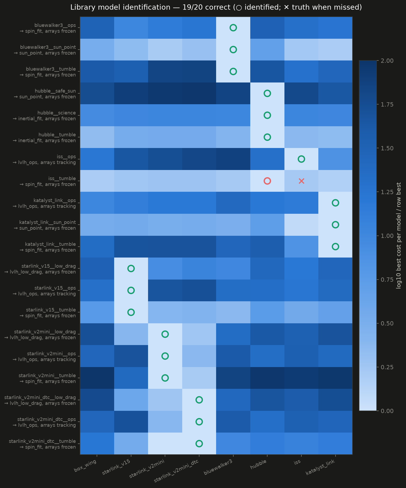
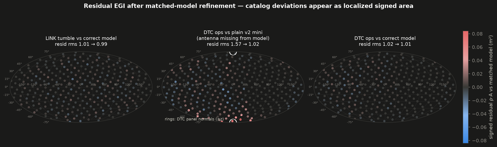
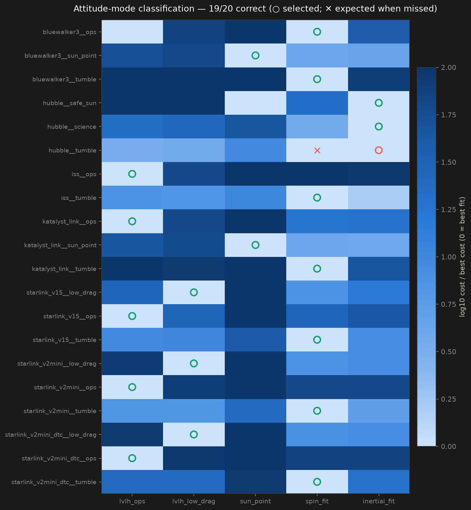
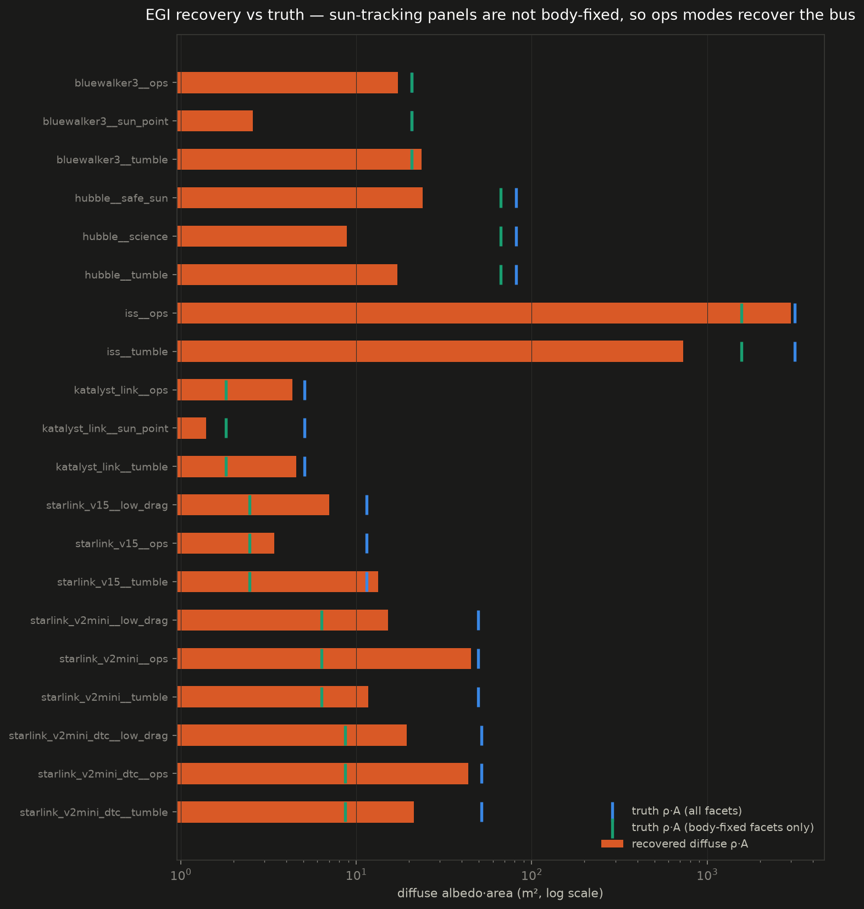

# photometry

Estimating RSO attitude and shape from visual-magnitude measurements aggregated
across a large LEO constellation's star trackers. See
[docs/constellation-photometric-attitude-shape-estimation.md](docs/constellation-photometric-attitude-shape-estimation.md)
for the full design.

## What's here

- `src/photometry/` — simulation of opportunistic star-tracker detections
  (Walker shell, LVLH-mounted trackers, facet-BRDF radiometry) and inversion
  (spin-period periodogram, spin-pole grid search, EGI shape recovery by NNLS).
- `src/photometry/measurements.py` — the `ObservationSet` schema. This is the
  real-data interface: reduce calibrated tracklets (time, angles, magnitude,
  range from OD) into this schema and run the identical inversion code.
- `scripts/run_pipeline.py` — end-to-end: simulate → invert → `results/`.
- `scripts/make_charts.py` — dark-themed chart set from saved results.
- `results/` — baseline scenario outputs and charts.

## Quickstart

```bash
pip install -e .
python scripts/run_pipeline.py results
python scripts/make_charts.py results results/charts
python -m pytest tests/
```

## Baseline scenario results

10,000-satellite Walker shell (550 km / 53°), trackers 5° above local
horizontal; tumbling box-wing target at 620 km spinning at 127.4 s. Over a
3.2 h arc: **5,703 detections from 588 distinct observers**, phase angles
14–142°. Recovery: spin period to **1 ms**, spin pole to **0.04°**, and the
convex shape's extended Gaussian image (joint Lambert + specular NNLS) with
98% of recovered albedo-area within 15° of true facet normals (the
anti-sunward facet is unilluminated for the whole arc and correctly
unobservable).


## Day-in-the-life fleet study

Seven library satellites built from open-source dimensions — Starlink v1.5
(one 1-axis shoulder array), Starlink v2 mini (two 2-axis shoulder+wrist
arrays), v2 mini DTC (adds a half-bus-length nadir antenna panel),
BlueWalker 3 (bus centered in a fixed 8x8 m array), Hubble, the ISS, and
Katalyst's LINK servicer (Swift reboost mission, launched 2026-07-03 and
currently in a multi-axis spin after losing two of three reaction
wheels) — each simulated for 24 h in several attitude / array-pointing
modes (nadir-hold ops with sun-tracking arrays, knife-edge low-drag,
sun-point, inertial science pointing, propeller tumble). 20 scenarios
total (`photometry/scenarios.py`, results in `results/fleet/`).

- **Mode classification: 19/20 correct** against a hypothesis bank of
  {LVLH-hold, knife-edge, sun-point, fitted uniform spin, fitted fixed
  inertial attitude}. The one miss is physics, not software: Hubble
  tumbling about its own cylinder axis is photometrically near-static
  (axisymmetric), and the classifier reasonably reports "no detectable
  rotation".
- Tumble spin states recover to ~0.1° pole / sub-ms period; discrete
  ambiguities remain for symmetric shapes (90° body-axis swaps for
  plate-like buses, 180° flips for cylinders).
- Ops-mode EGIs recover the **body-fixed** facets (bus, fixed antennas) —
  sun-tracking arrays are not stationary in the body frame and correctly
  do not appear as body-fixed area; a real product would model them with
  the articulation law, as the classifier's forward model does.
- ISS is saturation-limited (star trackers cap at mag -1) yet still
  classifies correctly from ~3-6k unsaturated long-range detections.
- The LINK tumble scenario — the shape of practical interest given the
  spacecraft's actual anomaly — recovers spin period exactly (127.4 s),
  pole to 0.07°, and the correct body spin axis (the asymmetric
  bus-plus-wings geometry breaks the axis degeneracy that flat panel
  sats suffer); movie attitude error 0.1° against nav truth.
- Per-scenario LVLH validation movies (truth shape at truth attitude vs
  the inverted product at estimated attitude, with projections onto the
  three LVLH planes) are in `results/movies/` — regenerate with
  `python scripts/make_movies.py`. The inverted product renders as two
  layers: a Minkowski-reconstructed convex solid (face normals/areas
  matched to the recovered EGI) and the raw EGI disks (oriented area,
  exploded outward — photometry recovers no position information).

## Library model identification

`scripts/run_model_match.py` treats a scenario's observations as an
unknown target and sweeps the full model library x attitude hypotheses x
array configurations, scoring each with the photometric forward model.
The photometric offset carries a 0.5-mag prior instead of being free, so
absolute brightness (range is known) lets size discriminate between
models. Across all 20 scenarios: **19/20 correct
model + attitude-mode + array-config identifications**, including
separating Starlink v2 mini DTC from the plain v2 mini (the
half-bus-length nadir antenna panel is photometrically detectable:
best-fit cost 1.09 vs 2.64 for the non-DTC model) and identifying that
ISS/v2-mini arrays were sun-tracking rather than frozen.

The one miss is diagnostic gold: the tumbling ISS identifies as "Hubble"
— but at cost 42 where correct matches typically score ~1, i.e. *nothing*
fits, and a real product would report "no confident match". The cause is
saturation censoring: detections brighter than the tracker cap are
discarded, so the surviving photometry looks like a much smaller object.
The fix is a truncated (censored) likelihood — future work.



## Matched-model refinement and residual EGI

`inversion/refine.py` promotes the match winner to a refined product:
full-resolution attitude re-fit plus a **signed residual EGI** solved on
top of the matched model. Deviations from the catalog appear as localized
signed oriented area; a catalog-true target leaves noise. Demo
(`scripts/run_refine.py`, chart 09): matching the DTC scenario against
the *plain* v2 mini model recovers +0.55 m² of residual area within 25°
of the missing antenna's nadir normal (residual rms 1.57 → 1.02), while
both correct-model control cases stay flat at the noise floor.



## Shape reconstruction

`inversion/minkowski.py` reconstructs the convex body whose face
normals/areas match the recovered EGI. The default solver is
variational — minimize the support functional `(a·h)/V(h)^(1/3)` with
the analytic gradient `dV/dh_i = A_i(h)` — which converges slab-like
EGIs to correct proportions (e.g. Starlink v1.5 recovers a
7.7 × 3.7 × 1.0 m slab against the true 8.1 × 2.7 m array) where a
per-face fixed-point stalls; the fixed point remains as fallback.

Validation movies (`results/movies/`) use a split layout: left, the
model-free inversion (Minkowski hull + raw EGI disks) against truth;
right, the Tier-2 identified library model at the identified attitude
and array articulation over faint truth — with 2D projections onto the
three LVLH planes below.




**Observability caveat**: trackers canted 5° above the local horizontal
only see objects **above** the shell altitude. Several real targets (ISS
at ~420 km, Hubble at ~530 km, in-shell Starlinks) sit at or below the
550 km shell; the study places all targets on a common 620 km orbit so
the geometry is comparable, and records real altitudes in the metadata.
